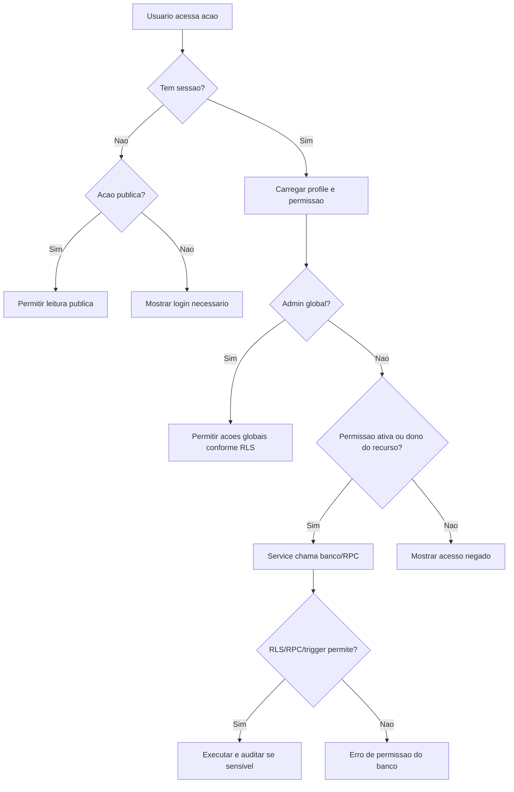

# Atores e permissoes

## Objetivo

Mapear os papeis do sistema, o que cada ator pode fazer, o que deve ser bloqueado e quais pontos dependem de RLS, RPC, trigger ou estado de permissao.

## Atores envolvidos

- Visitante
- Usuario comum
- Usuario autenticado
- Criador autorizado
- Criador com permissao revogada
- Capitao
- Membro de equipe
- Organizador do torneio
- Admin global
- Sistema/Supabase/RLS

## Pre-condicoes

- Supabase Auth e a origem de usuarios.
- `profiles.role` aceita `admin` ou `user`.
- A autorizacao para criar torneios vem de `tournament_creator_permissions.status = active` ou de admin.
- RLS esta habilitado nas tabelas principais no `supabase/schema.sql`.

## Gatilho

Qualquer usuario acessa uma rota ou tenta executar uma acao do sistema.

## Caminho feliz

1. Sistema identifica sessao pelo `AuthProvider`.
2. Front-end carrega `profiles` e permissao ativa.
3. Interface mostra acoes compativeis com o papel.
4. Service executa consulta, insert, update, delete ou RPC.
5. Banco revalida `auth.uid()`, `is_admin()`, `can_create_tournament()` ou `can_manage_tournament()`.
6. Acao autorizada altera estado e, quando sensivel, gera auditoria.

## Fluxos alternativos

- Visitante acessa rotas publicas sem sessao.
- Usuario comum acessa rota protegida e recebe tela de login.
- Criador autorizado perde permissao e volta ao comportamento de usuario comum.
- Admin global ignora alguns bloqueios administrativos pelo `assert_action_unlocked`, conforme regra atual.
- Capitao administra apenas sua equipe enquanto inscricoes estiverem abertas.

## Erros possiveis

- Sessao ausente em rota protegida.
- Perfil inexistente apos cadastro por falha do trigger `handle_new_auth_user`.
- RLS nega leitura/escrita e a UI mostra mensagem generica.
- Permissao revogada bloqueia criacao/gestao de torneio.
- Action lock bloqueia acao de usuario nao admin.

## Regras de permissao

| Ator | Pode | Nao pode | Fonte real |
| --- | --- | --- | --- |
| Visitante | Ver torneios publicados, participantes confirmados, chaves, resultados e rankings publicados. | Inscrever-se, criar/editar, ver dados privados ou audit logs. | Policies `*_select_public`. |
| Usuario comum | Editar proprio perfil, pedir permissao, inscrever-se, cancelar inscricao propria, participar/contestar partida propria. | Virar admin, alterar role, permissoes, torneio alheio, ranking ou resultado alheio. | RLS, triggers e RPCs. |
| Criador autorizado | Criar torneios e gerenciar torneios proprios enquanto tiver permissao ativa. | Acessar admin global ou alterar permissoes. | `can_create_tournament()` e `can_manage_tournament()`. |
| Criador revogado | Agir como usuario comum e ver historico permitido. | Criar novo torneio e, pela regra atual, gerir torneios proprios se `can_create_tournament()` retornar falso. | `can_manage_tournament()`. |
| Capitao | Criar equipe, adicionar/remover membros nao capitaes, enviar equipe para inscricao. | Gerenciar equipe alheia, remover a si mesmo no MVP, confirmar inscricao administrativamente. | `can_manage_team()`, triggers e policies. |
| Membro | Ver equipe propria e participar da partida. | Editar equipe ou enviar inscricao, salvo regra futura. | `is_team_member()` e UI. |
| Organizador | Gerenciar torneio proprio, inscricoes, equipes, chave, resultados, disputas e ranking do torneio. | Acessar admin global, alterar roles ou permissoes globais. | `can_manage_tournament()`. |
| Admin global | Administrar tudo, aprovar/rejeitar pedidos, revogar permissoes, ver auditoria e aplicar bloqueios. | Expor segredo no front-end ou burlar historico sem rastro. | `is_admin()` e RLS. |

## Regras de seguranca

- Front-end nunca usa `service_role`.
- Usuario comum nao altera `profiles.role` nem `profiles.email`.
- Permissao de criador e separada de role global.
- Escritas sensiveis passam por RPCs/triggers quando exigem transicao, historico ou auditoria.
- `audit_logs` e restrito a admin.
- `action_locks` ativo pode ser lido por anon/authenticated para explicar indisponibilidade, mas escrito apenas por admin.

## Estados envolvidos

- `profiles.role`: `admin`, `user`.
- `tournament_creator_requests.status`: `pending`, `approved`, `rejected`, `cancelled`.
- `tournament_creator_permissions.status`: `active`, `revoked`.
- `tournaments.status`: `draft`, `registrations_open`, `registrations_closed`, `ongoing`, `finished`, `cancelled`.
- `teams.status`, `team_members.status`, `tournament_registrations.status`, `bracket_matches.status`, `match_results.status`, `action_locks.is_locked`.

## Dados lidos

- `profiles`
- `tournament_creator_requests`
- `tournament_creator_permissions`
- `tournaments`
- `teams`
- `team_members`
- `tournament_registrations`
- `audit_logs`
- `action_locks`
- Services: `src/services/tournaments.ts`, `src/services/teams.ts`, `src/services/tournamentCreatorRequests.ts`, `src/services/admin.ts`.

## Dados escritos

- Perfil proprio em `profiles`.
- Pedidos e permissoes conforme papel.
- Torneios, inscricoes, equipes, chaves, resultados, ranking e bloqueios conforme permissao.

## Telas envolvidas

- `#/login`, `#/cadastro`, `#/recuperar-senha`, `#/minha-conta`
- `#/torneios`, `#/torneios/novo`, `#/torneios/:id`, `#/torneios/:id/editar`
- `#/torneios/:id/participantes`, `#/torneios/:id/equipes`, `#/torneios/:id/chave`, `#/torneios/:id/ranking`
- `#/meus-pedidos`, `#/solicitar-criacao-torneio`, `#/admin`, `#/admin/pedidos`

## Services envolvidos

- `src/services/tournaments.ts`
- `src/services/teams.ts`
- `src/services/brackets.ts`
- `src/services/rankings.ts`
- `src/services/admin.ts`
- `src/services/tournamentCreatorRequests.ts`

## Componentes envolvidos

- `ProtectedRoute`, `AdminRoute`, `SiteHeader`, `UserMenu`, `ProfileForm`
- `TournamentForm`, `TournamentStatusBadge`, `TournamentRegistrationStatusBadge`, `TeamStatusBadge`
- `CreatorRequestCard`, `CreatorPermissionCard`

## Fluxograma

## Casos de uso relacionados

- AUTH-001 a AUTH-010
- PERM-001 a PERM-010
- TOURN-001 a TOURN-015
- REG-001 a REG-015
- TEAM-001 a TEAM-015
- ADMIN-001 a ADMIN-010
- AUDIT-001 a AUDIT-008
- SECURITY-001 a SECURITY-008

## Pontos de falha

- Divergencia entre botao visivel e RLS.
- Criador revogado pode ver UI antiga se contexto nao for atualizado.
- Mensagens de erro do banco podem chegar genericas.
- Dados pessoais como email/RA aparecem no painel admin; devem continuar fora de telas publicas.

## Recomendacoes

- Padronizar mensagens de erro por codigo/acao.
- Adicionar testes de RLS por papel.
- Criar helper de permissao unico no front-end para reduzir divergencia entre telas.
- Documentar explicitamente a regra de gestao de torneio apos revogacao.

