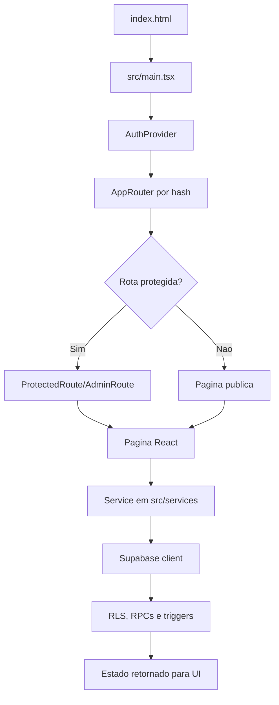

# Mapa geral do sistema

## Objetivo

Mostrar como rotas, paginas, services, Supabase, RLS, triggers e RPCs se conectam nos fluxos principais.

## Atores envolvidos

- Visitante
- Usuario comum
- Usuario autenticado
- Criador autorizado
- Capitao
- Membro de equipe
- Organizador do torneio
- Admin global
- Sistema/Supabase/RLS

## Pre-condicoes

- Aplicacao React usa hash routing em `src/App.tsx`.
- `AuthProvider` centraliza sessao, profile e permissao ativa.
- Services em `src/services/` isolam acesso ao Supabase.
- `supabase/schema.sql` e a fonte do schema consolidado.

## Gatilho

Usuario navega no header ou acessa uma URL `#/...`.

## Caminho feliz

1. `src/main.tsx` monta `App`.
2. `AppRouter` normaliza a rota por hash.
3. Rotas protegidas usam `ProtectedRoute`; rotas admin usam `AdminRoute`.
4. Pagina chama service.
5. Service chama Supabase client.
6. Banco aplica RLS, triggers e RPCs.
7. Pagina exibe loading, erro, vazio ou sucesso.

## Fluxos alternativos

- Rota demo antiga ainda existe em `src/App.tsx` para `#home`, `#dashboard`, `#groups`, `#matches`, `#result` e similares.
- Rotas reais de grupos, partidas e resultado individual ainda nao existem como modulos persistidos.
- Ranking usa leitura derivada em TypeScript, nao snapshot oficial escrito pela UI.

## Erros possiveis

- Hash nao reconhecido cai no demo app.
- Rota listada em docs antigos nao existe no roteador real.
- Service retorna erro de RLS sem contexto de acao.
- Tipos manuais divergem do schema se migration mudar sem atualizar `src/lib/supabase/types.ts`.

## Regras de permissao

- Leitura publica depende de status publicado e policies publicas.
- Escrita administrativa depende de `can_manage_tournament()`, `is_admin()` ou RPC especifica.
- Rota protegida nao substitui RLS.

## Regras de seguranca

- Hash routing nao e fronteira de seguranca.
- Cada service precisa ser tratado como chamada potencialmente manipulavel pelo usuario.
- Toda regra sensivel deve continuar no banco.

## Estados envolvidos

- Sessao Supabase.
- Profile carregado.
- Permissao ativa carregada.
- Status de torneio, inscricao, equipe, partida, resultado, ranking e bloqueio.

## Dados lidos

- `profiles`
- `tournaments`
- `tournament_registrations`
- `teams`
- `team_members`
- `tournament_brackets`
- `bracket_matches`
- `match_results`
- `match_result_history`
- `tournament_standings`
- `standing_entries`
- `audit_logs`
- `action_locks`

## Dados escritos

- Via services e RPCs: perfis, pedidos, permissoes, torneios, inscricoes, equipes, chaves, resultados, check-in, W.O., desclassificacao, ranking snapshots e bloqueios.

## Telas envolvidas

- `src/pages/auth/*`
- `src/pages/tournaments/*`
- Rotas demo em `src/App.tsx`

## Services envolvidos

- `admin.ts`
- `brackets.ts`
- `rankings.ts`
- `teams.ts`
- `tournamentCreatorRequests.ts`
- `tournaments.ts`

## Componentes envolvidos

- Layout: `AuthenticatedShell`, `SiteHeader`, `PageBackButton`, `PageLayout`
- Auth: `LoginForm`, `RegisterForm`, `ProfileForm`, `UserMenu`
- Tournament: `TournamentForm`, badges e cards das paginas

## Fluxograma

## Casos de uso relacionados

- Todos os casos de `18-matriz-de-casos-de-uso.md`.

## Pontos de falha

- Docs antigos citam rotas como `/t/:slug`, `/torneios/:id/grupos`, `/torneios/:id/partidas` e `/partidas/:id/resultado`; no roteador real, esses modulos persistidos nao estao implementados.
- `TournamentsPage` mostra "Excluir" para admin; banco permite delete admin, mas precisa confirmar impacto e auditoria.
- `TournamentForm` ainda contem texto dizendo que equipes/chaves/ranking sao posteriores, embora equipes, chave e ranking parcial ja existam.

## Recomendacoes

- Criar uma tabela unica de rotas reais versus rotas planejadas.
- Remover ou isolar demos antigas quando o MVP real estiver completo.
- Atualizar textos da UI para nao parecer que fluxo implementado ainda e futuro.

