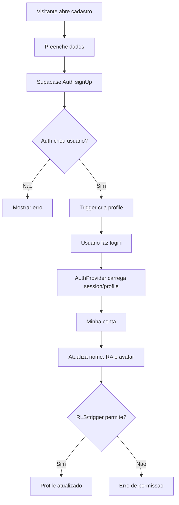

# Autenticacao, conta e perfil

## Objetivo

Documentar cadastro, login, logout, recuperacao de senha, edicao de perfil, avatar, RA, rotas protegidas e criacao automatica de `profiles`.

## Atores envolvidos

- Visitante
- Usuario comum
- Usuario autenticado
- Admin global
- Sistema/Supabase/RLS

## Pre-condicoes

- Supabase client configurado com `VITE_SUPABASE_URL` e `VITE_SUPABASE_ANON_KEY`.
- `profiles` existe e referencia `auth.users(id)`.
- Trigger `on_auth_user_created` chama `handle_new_auth_user()`.
- `avatar_key` precisa estar na lista permitida.

## Gatilho

Visitante acessa `#/cadastro`, `#/login`, `#/recuperar-senha` ou rota protegida.

## Caminho feliz

1. Visitante abre `#/cadastro`.
2. Preenche nome, email, senha e avatar.
3. `RegisterForm` chama `supabase.auth.signUp`.
4. Supabase Auth cria usuario.
5. Trigger SQL cria `profiles` com `role = user`, email, display name, RA opcional e avatar.
6. Usuario faz login por `LoginForm`.
7. `AuthProvider` carrega sessao e profile.
8. Usuario edita display name, RA e avatar em `#/minha-conta`.
9. `ProfileForm` atualiza apenas campos permitidos.
10. RLS e trigger bloqueiam alteracao de email, id, created_at ou role por usuario comum.

## Fluxos alternativos

- Recuperacao de senha: `PasswordRecoveryForm` chama `supabase.auth.resetPasswordForEmail`.
- Logout: `LogoutButton` chama `signOut()` e redireciona para `#/login`.
- Rota protegida sem sessao: `ProtectedRoute` mostra `AccessDeniedPage` com CTA para login.
- Rota admin sem admin: `AdminRoute` mostra acesso negado.
- Login com email nao confirmado retorna erro amigavel.

## Erros possiveis

- Email ja cadastrado.
- Senha fraca.
- Credenciais invalidas.
- Email nao confirmado.
- Variaveis de ambiente ausentes.
- Profile nao encontrado apos sign up.
- RLS bloqueia edicao de profile alheio.
- Usuario tenta alterar `role` por request direta.

## Regras de permissao

- Visitante pode cadastrar, logar e recuperar senha.
- Usuario autenticado pode ler e atualizar apenas o proprio profile.
- Admin pode ler/atualizar profiles conforme policies, inclusive role.
- Usuario comum nunca pode promover a si mesmo.

## Regras de seguranca

- Senha fica somente no Supabase Auth.
- Nao existe tabela de senha no schema.
- Email e RA sao dados pessoais; nao devem aparecer em pagina publica.
- `protect_profile_update()` impede alteracao sensivel por usuario comum.
- `is_admin()` e SECURITY DEFINER para evitar recursao de RLS.

## Estados envolvidos

- `session`: presente/ausente.
- `profiles.role`: `admin`, `user`.
- `avatar_key`: `avatar_utfpr_blue`, `avatar_utfpr_green`, `avatar_utfpr_gold`, `avatar_competition`, `avatar_academic`.
- `profileError`, loading e sucesso no front-end.

## Dados lidos

- `auth.users` via Supabase Auth.
- `profiles`: `id`, `email`, `display_name`, `ra`, `avatar_key`, `role`.
- `tournament_creator_permissions` para atualizar `canCreateTournaments`.

## Dados escritos

- `auth.users` no cadastro.
- `profiles` por trigger.
- `profiles.display_name`, `profiles.ra`, `profiles.avatar_key` no perfil.

## Telas envolvidas

- `#/cadastro` -> `RegisterPage`
- `#/login` -> `LoginPage`
- `#/recuperar-senha` -> `PasswordRecoveryPage`
- `#/minha-conta` e `#/perfil` -> `MyAccountPage`
- `#/acesso-negado` -> `AccessDeniedPage`

## Services envolvidos

- Supabase Auth direto nos componentes auth.
- `src/context/AuthContext.tsx`
- `src/lib/supabase/client.ts`

## Componentes envolvidos

- `RegisterForm`
- `LoginForm`
- `PasswordRecoveryForm`
- `ProfileForm`
- `AvatarPicker`
- `ProtectedRoute`
- `AdminRoute`
- `UserMenu`

## Fluxograma

## Casos de uso relacionados

- AUTH-001 Criar conta
- AUTH-002 Login
- AUTH-003 Logout
- AUTH-004 Recuperar senha
- PROFILE-001 Editar perfil
- PROFILE-002 Escolher avatar
- PROFILE-003 Informar RA
- AUTH-008 Acessar rota protegida sem login
- AUTH-009 Acessar rota admin sem admin
- AUTH-010 Criar profile automatico

## Pontos de falha

- Trigger de profile falhar deixa usuario autenticado sem profile.
- Mensagens de recuperacao dependem da configuracao do Supabase.
- `ProfileForm` nao permite alterar email; isso e correto, mas deve estar claro.
- `UserMenu` pode mostrar estado antigo ate `refreshProfile()` terminar.

## Recomendacoes

- Adicionar teste E2E de cadastro ate profile criado.
- Adicionar validacao visual para RA se houver formato institucional.
- Criar rotina administrativa para corrigir profile ausente.

