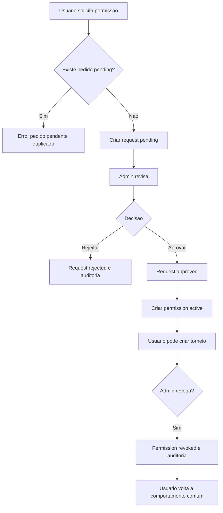

# Permissao para criar torneios

## Objetivo

Documentar pedido, acompanhamento, cancelamento, aprovacao, rejeicao, criacao de permissao ativa, revogacao e tentativas de burla direta.

## Atores envolvidos

- Usuario comum
- Usuario autenticado
- Criador autorizado
- Criador com permissao revogada
- Admin global
- Sistema/Supabase/RLS

## Pre-condicoes

- Usuario tem profile.
- Admin inicial foi promovido por `bootstrap_first_admin`.
- `tournament_creator_requests` e `tournament_creator_permissions` possuem RLS.
- `can_create_tournament()` consulta permissao ativa e action lock `create_tournament`.

## Gatilho

Usuario acessa `#/solicitar-criacao-torneio` ou `#/meus-pedidos`.

## Caminho feliz

1. Usuario autenticado informa justificativa com pelo menos 20 caracteres.
2. Front-end chama `createCreatorRequest`.
3. Banco cria pedido `pending` para `auth.uid()`.
4. Admin acessa `#/admin/pedidos`.
5. Admin aprova pedido pendente.
6. Trigger `validate_tournament_creator_request_update()` define `reviewed_by` e `reviewed_at`.
7. Aprovacao cria linha em `tournament_creator_permissions` com `status = active`.
8. Auditoria registra decisao e concessao.
9. `AuthProvider.refreshCreatorPermission()` passa a permitir criar torneio.

## Fluxos alternativos

- Usuario ve historico em `#/meus-pedidos`.
- Usuario cancela pedido pendente.
- Admin rejeita pedido com `admin_notes`.
- Admin revoga permissao ativa em `#/admin/pedidos`.
- Usuario revogado envia novo pedido se precisar.
- Admin visualiza historico de permissoes ativas e revogadas.

## Erros possiveis

- Usuario sem login tenta pedir permissao.
- Motivo curto.
- Pedido pendente duplicado bloqueado por indice parcial.
- Admin tenta decidir pedido que nao esta pendente.
- Usuario comum tenta aprovar o proprio pedido por chamada direta.
- Usuario comum tenta inserir permissao ativa diretamente.
- Reativacao por update de permissao revogada e bloqueada.

## Regras de permissao

- Usuario cria apenas pedido proprio `pending`.
- Usuario cancela apenas pedido proprio pendente.
- Admin le e decide todos os pedidos.
- Admin cria/revoga permissao ativa.
- Usuario comum le apenas suas permissoes.
- Admin le todas as permissoes.

## Regras de seguranca

- Pedido aprovado nao muda `profiles.role`.
- Permissao ativa e separada do pedido historico.
- Revogacao preserva historico.
- `validate_tournament_creator_permission_write()` bloqueia escrita por usuario comum.
- `can_create_tournament()` e a fonte real para criar torneio.

## Estados envolvidos

- `request_status`: `pending`, `approved`, `rejected`, `cancelled`.
- `creator_permission_status`: `active`, `revoked`.
- `action_locks.action = create_tournament`.

## Dados lidos

- `tournament_creator_requests`
- `tournament_creator_permissions`
- `profiles` para dados administrativos
- `audit_logs`

## Dados escritos

- Novo pedido.
- Pedido atualizado para `approved`, `rejected` ou `cancelled`.
- Permissao `active` criada.
- Permissao `revoked` atualizada.
- Logs de auditoria.

## Telas envolvidas

- `#/solicitar-criacao-torneio`
- `#/meus-pedidos`
- `#/admin/pedidos`
- `#/torneios/novo`

## Services envolvidos

- `src/services/tournamentCreatorRequests.ts`
- `src/context/AuthContext.tsx`
- `src/services/tournaments.ts`

## Componentes envolvidos

- `RequestTournamentCreatorPage`
- `MyCreatorRequestsPage`
- `AdminCreatorRequestsPage`
- `CreatorRequestCard`
- `CreatorPermissionCard`
- `CreatorRequestStatusBadge`
- `CreatorPermissionStatusBadge`

## Fluxograma

## Casos de uso relacionados

- PERM-001 Solicitar permissao
- PERM-002 Ver status do pedido
- PERM-003 Cancelar pedido pendente
- PERM-004 Admin aprovar pedido
- PERM-005 Admin rejeitar pedido
- PERM-006 Criar permissao ativa
- PERM-007 Revogar permissao
- PERM-008 Revogado tenta criar torneio
- PERM-009 Usuario tenta criar permissao para si mesmo
- PERM-010 Admin ve historico

## Pontos de falha

- UI pode dizer "permissao ativa" ate o contexto atualizar.
- Admin pode revogar com motivo opcional; para acoes criticas talvez motivo devesse ser obrigatorio.
- Criador revogado perde gestao se `can_manage_tournament()` exigir `can_create_tournament()`; regra precisa ser assumida como atual e discutida.

## Recomendacoes

- Tornar motivo de revogacao obrigatorio para auditoria mais forte.
- Exibir alerta preventivo quando `create_tournament` estiver bloqueado por `action_locks`.
- Documentar regra de acesso a torneios antigos apos revogacao em texto de UI.

