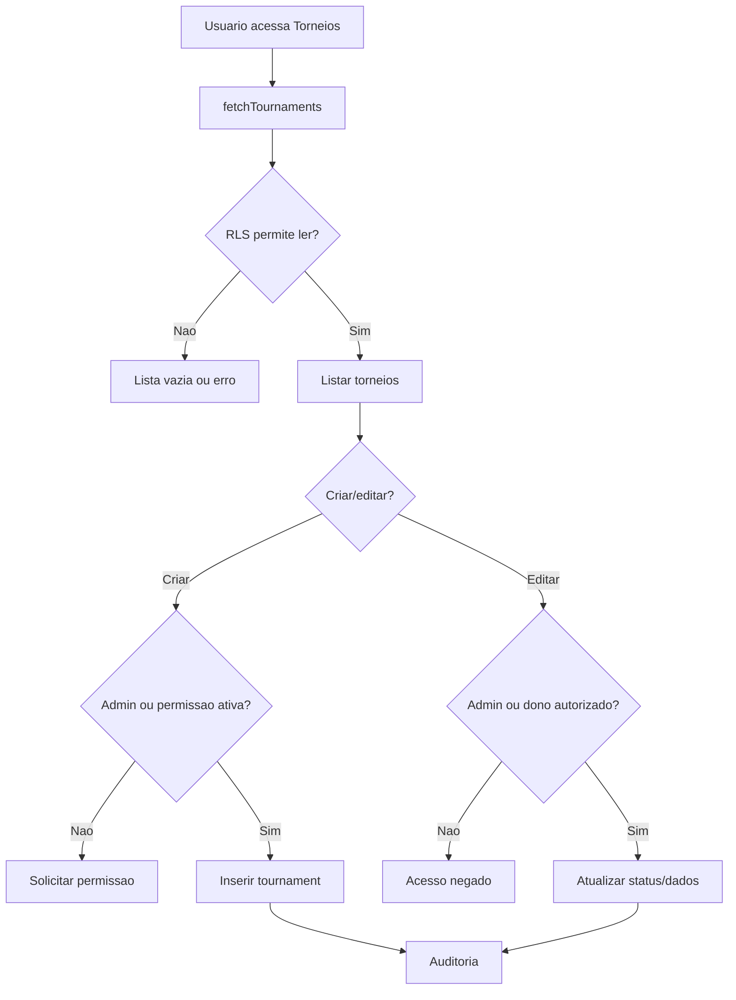

# Torneios, CRUD e publicacao

## Objetivo

Documentar listagem publica, criacao, edicao, status, abertura/fechamento de inscricoes, cancelamento, finalizacao, exclusao e acesso a torneio inexistente.

## Atores envolvidos

- Visitante
- Usuario comum
- Criador autorizado
- Criador com permissao revogada
- Organizador do torneio
- Admin global
- Sistema/Supabase/RLS

## Pre-condicoes

- Tabela `tournaments` existe.
- Usuario criador tem permissao ativa ou e admin.
- Status do torneio controla publicacao e inscricoes.
- RLS permite leitura publica de torneios fora de `draft`.

## Gatilho

Usuario acessa `#/torneios`, `#/torneios/novo`, `#/torneios/:id` ou `#/torneios/:id/editar`.

## Caminho feliz

1. Visitante ou usuario autenticado abre `#/torneios`.
2. `fetchTournaments()` lista torneios permitidos por RLS.
3. Criador autorizado clica em criar torneio.
4. `CreateTournamentPage` valida `canCreateTournaments`.
5. `TournamentForm` monta dados basicos, equipe, check-in, formato e status.
6. `createTournament()` insere linha com `created_by = auth.uid()`.
7. Banco valida `can_create_tournament()`.
8. Usuario acessa pagina publica do torneio.
9. Criador/admin edita status para abrir inscricoes, fechar, iniciar, finalizar ou cancelar.

## Fluxos alternativos

- Admin edita qualquer torneio, inclusive em andamento.
- Criador edita apenas torneio proprio enquanto mantiver permissao ativa.
- Torneio `draft` aparece apenas para dono/admin.
- Admin exclui torneio fisicamente.
- Criador sem permissao ou revogado e direcionado para pedido de permissao.
- Torneio inexistente mostra estado vazio/erro.

## Erros possiveis

- Nome ou modalidade invalida.
- Datas inconsistentes.
- `max_participants` menor que 2 no front-end ou menor que 1 no banco.
- Usuario sem permissao tenta criar.
- Criador tenta editar torneio alheio.
- Action lock bloqueia criacao, edicao ou exclusao.
- Delete admin remove dados em cascade; precisa cuidado operacional.

## Regras de permissao

- Visitante ve apenas torneios publicados.
- Usuario comum ve publicados e pode pedir permissao.
- Criador autorizado cria e edita torneios proprios.
- Admin cria, edita e exclui qualquer torneio.
- Criador revogado nao cria novo torneio; pela regra atual tambem perde gestao se `can_manage_tournament()` retornar falso.

## Regras de seguranca

- `tournaments_insert_creator` exige `created_by = auth.uid()` e `can_create_tournament()`.
- `protect_tournament_update()` impede trocar `id`, `created_at` e `created_by`.
- `assert_tournament_action_unlocked()` bloqueia acoes por `action_locks`.
- `audit_tournament_write()` registra criacao, update/status e delete.

## Estados envolvidos

- `draft`
- `registrations_open`
- `registrations_closed`
- `ongoing`
- `finished`
- `cancelled`

## Dados lidos

- `tournaments`
- Contagem operacional em `tournament_registrations`
- `tournament_creator_permissions`
- `action_locks`

## Dados escritos

- `tournaments`
- `audit_logs`

## Telas envolvidas

- `#/torneios`
- `#/torneios/novo`
- `#/torneios/:id`
- `#/torneios/:id/editar`

## Services envolvidos

- `src/services/tournaments.ts`
- `src/services/admin.ts` indiretamente por bloqueios/auditoria

## Componentes envolvidos

- `TournamentsPage`
- `CreateTournamentPage`
- `EditTournamentPage`
- `PublicTournamentPage`
- `TournamentForm`
- `SupabaseTournamentStatusBadge`

## Fluxograma

## Casos de uso relacionados

- TOURN-001 Visitante ve lista publica
- TOURN-002 Usuario logado ve lista publica
- TOURN-003 Criador cria torneio
- TOURN-004 Criador edita proprio torneio
- TOURN-005 Admin edita qualquer torneio
- TOURN-006 Criador sem permissao tenta criar
- TOURN-007 Criador revogado tenta criar
- TOURN-008 Draft nao aparece publicamente
- TOURN-009 Abrir inscricoes
- TOURN-010 Fechar inscricoes
- TOURN-011 Cancelar torneio
- TOURN-012 Finalizar torneio
- TOURN-013 Editar torneio em andamento
- TOURN-014 Excluir torneio
- TOURN-015 Acessar torneio inexistente

## Pontos de falha

- Textos do `TournamentForm` dizem que cadastro de membros/chaves/ranking sao futuros, mas parte ja esta implementada.
- Nao ha confirmacao especifica para mudar status para `ongoing`, `finished` ou `cancelled`.
- Excluir torneio como admin depende de confirmacao simples do navegador.
- Nao ha tela dedicada para "publicar" alem de alterar status.

## Recomendacoes

- Criar fluxo explicito de transicao de status com confirmacao e explicacao de impacto.
- Exigir justificativa para alteracoes em torneios `ongoing`, `finished` ou delete.
- Atualizar microcopy de formularios conforme modulos ja implementados.

