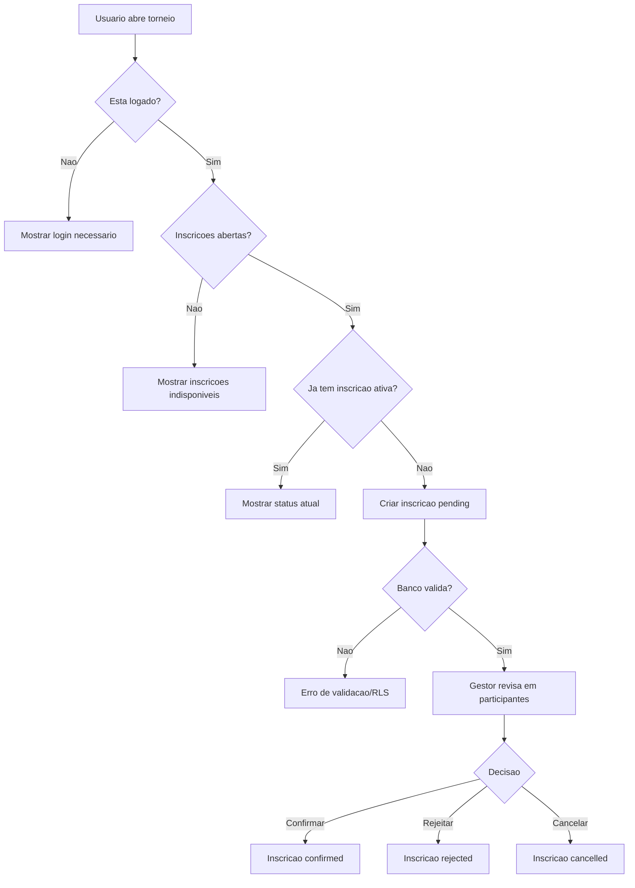

# Inscricoes e participantes

## Objetivo

Documentar inscricao individual, cancelamento pelo usuario, gestao de participantes, seed, visibilidade publica e estados de participante.

## Atores envolvidos

- Visitante
- Usuario comum
- Usuario autenticado
- Capitao
- Organizador do torneio
- Admin global
- Sistema/Supabase/RLS

## Pre-condicoes

- Torneio publicado existe.
- Para inscricao, usuario esta autenticado.
- `tournament_registrations` esta com RLS ativo.
- Torneio individual usa `registration_type = individual`; torneio por equipe usa fluxo de equipes.

## Gatilho

Usuario abre `#/torneios/:id`, `#/minhas-inscricoes` ou gestor abre `#/torneios/:id/participantes`.

## Caminho feliz

1. Usuario autenticado abre a pagina publica do torneio.
2. Sistema confirma que o torneio esta em `registrations_open`.
3. Usuario informa nome de exibicao da inscricao.
4. `createTournamentRegistration()` insere inscricao `pending`.
5. Banco valida usuario, status do torneio, tipo de inscricao, limite e duplicidade.
6. Usuario acompanha a inscricao em `#/minhas-inscricoes`.
7. Gestor abre participantes e confirma ou rejeita a inscricao.
8. Inscricoes confirmadas aparecem publicamente sem email nem RA.

## Fluxos alternativos

- Usuario deslogado ve CTA de login antes de se inscrever.
- Usuario cancela inscricao propria `pending` ou `confirmed` antes do torneio iniciar.
- Gestor cancela inscricao com observacao administrativa.
- Gestor edita seed de inscricao para chave seeded.
- Lista publica mostra apenas `confirmed`, `checked_in` e legado `registered`, conforme service.
- Inscricao por equipe e criada pela RPC `submit_team_registration()`.

## Erros possiveis

- Torneio nao encontrado ou em `draft`.
- Inscricoes fechadas.
- Usuario ja possui inscricao ativa no mesmo torneio.
- Limite de participantes atingido.
- Tipo de inscricao incompativel.
- Usuario comum tenta alterar campos administrativos.
- RLS bloqueia leitura de inscricoes pendentes de terceiros.

## Regras de permissao

- Visitante le apenas participantes publicos confirmados de torneios publicados.
- Usuario autenticado cria apenas inscricao propria.
- Usuario autenticado cancela apenas inscricao propria em status permitido.
- Admin e organizador autorizado gerenciam todas as inscricoes do torneio.
- Seed e notas administrativas sao gestao, nao fluxo publico.

## Regras de seguranca

- `registrations_insert_open_tournament` exige `user_id = auth.uid()`.
- `validate_tournament_registration_write()` valida status, limite, tipo e transicoes.
- `assert_registration_action_unlocked()` aplica bloqueios para `register`, `cancel_registration` e `manage_registration`.
- Dados pessoais de `profiles` nao sao expostos na lista publica.
- Inscricoes rejeitadas/canceladas nao devem ser reativadas por update.

## Estados envolvidos

- `pending`
- `confirmed`
- `cancelled`
- `rejected`
- `checked_in`
- `registered` como legado migrado/compatibilidade

## Dados lidos

- `tournaments`
- `tournament_registrations`
- `profiles` indiretamente para usuario atual
- `teams` quando a inscricao e por equipe
- `action_locks`

## Dados escritos

- `tournament_registrations`
- `teams` sincronizada quando inscricao por equipe muda de status
- `audit_logs`

## Telas envolvidas

- `#/torneios/:id`
- `#/minhas-inscricoes`
- `#/torneios/:id/participantes`
- `#/torneios/:id/chave`

## Services envolvidos

- `src/services/tournaments.ts`
- `src/services/teams.ts`
- `src/services/brackets.ts`

## Componentes envolvidos

- `PublicTournamentPage`
- `MyRegistrationsPage`
- `TournamentParticipantsPage`
- `TournamentRegistrationStatusBadge`
- `SupabaseTournamentStatusBadge`

## Fluxograma

## Casos de uso relacionados

- REG-001 Usuario se inscreve em torneio individual
- REG-002 Visitante tenta se inscrever
- REG-003 Inscricao duplicada e bloqueada
- REG-004 Usuario cancela propria inscricao
- REG-005 Cancelamento fora do status permitido
- REG-006 Gestor confirma inscricao
- REG-007 Gestor rejeita inscricao
- REG-008 Gestor cancela inscricao
- REG-009 Gestor edita seed
- REG-010 Lista publica de participantes
- REG-011 Inscricao por equipe via capitao
- REG-012 Limite atingido
- REG-013 Torneio fechado bloqueia inscricao
- REG-014 Inscricao desclassificada sai da chave
- REG-015 W.O. marca no-show

## Pontos de falha

- `isPublicParticipant()` no service nao exclui explicitamente `no_show_at`.
- Mensagens de erro de RLS podem nao explicar qual regra falhou.
- Seed manual pode ficar sem explicacao para participantes.
- Confirmar/cancelar inscricao antes de iniciar torneio depende do status atual do torneio.

## Recomendacoes

- Excluir `no_show_at` da lista publica se o produto quiser esconder participantes com W.O.
- Criar mensagens de erro mapeadas por acao.
- Adicionar testes de inscricao duplicada, limite e cancelamento proprio.
- Exigir confirmacao com impacto para cancelamento administrativo.

