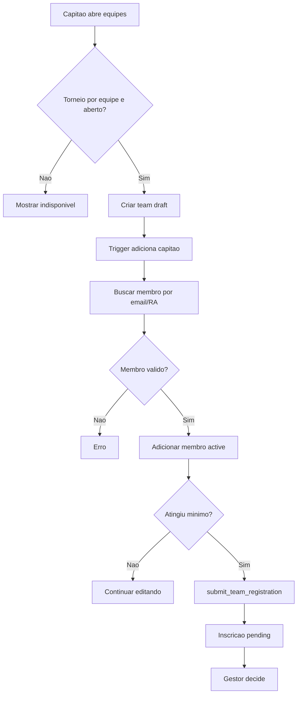

# Equipes, capitao e membros

## Objetivo

Documentar criacao de equipe, papel do capitao, membros, envio para inscricao, gestao por organizador/admin, cancelamento e limite do modulo de agentes livres.

## Atores envolvidos

- Usuario comum
- Usuario autenticado
- Capitao
- Membro de equipe
- Organizador do torneio
- Admin global
- Sistema/Supabase/RLS

## Pre-condicoes

- Torneio tem `registration_type = team`.
- Torneio esta em `registrations_open`.
- Usuario esta autenticado.
- `teams` e `team_members` possuem RLS e triggers.

## Gatilho

Usuario abre `#/torneios/:id/equipes` ou `#/torneios/:id/equipes/:teamId`.

## Caminho feliz

1. Usuario autenticado cria equipe em torneio por equipe.
2. Banco cria `teams` com `status = draft`, `captain_id = auth.uid()` e `created_by = auth.uid()`.
3. Trigger `handle_new_team()` adiciona o capitao como membro ativo.
4. Capitao busca membros por email ou RA exato.
5. Capitao adiciona membros ate respeitar `team_max_size`.
6. Quando atingir o minimo, capitao envia equipe para inscricao.
7. RPC `submit_team_registration()` cria inscricao `pending` com `team_id`.
8. Gestor confirma ou rejeita a inscricao da equipe.

## Fluxos alternativos

- Admin ou organizador gerencia equipe do torneio.
- Capitao remove membro que nao seja capitao.
- Capitao exclui equipe fisicamente apenas enquanto esta em `draft`.
- Gestor cancela equipe por exclusao logica com `cancel_team()`.
- Membro ativo consulta a propria equipe.
- Agentes livres existem apenas como configuracao `allow_free_agents`, sem fluxo implementado.

## Erros possiveis

- Torneio individual.
- Inscricoes fechadas ou prazo de equipe encerrado.
- Nome de equipe invalido ou duplicado.
- Capitao ja tem equipe ativa no torneio.
- Membro nao encontrado por email/RA.
- Membro ja esta em equipe ativa do torneio.
- Equipe incompleta ao enviar.
- Equipe atingiu tamanho maximo.
- Capitao tenta remover a si mesmo.

## Regras de permissao

- Usuario cria apenas equipe propria como capitao.
- Capitao gerencia membros da propria equipe enquanto o torneio permite.
- Membro ve equipe propria, mas nao gerencia.
- Admin e organizador autorizado gerenciam equipes do torneio.
- Visitante ve apenas equipes confirmadas de torneios publicados.

## Regras de seguranca

- `teams_insert_captain` exige `created_by = auth.uid()` e `captain_id = auth.uid()`.
- `validate_team_write()` bloqueia equipes em torneios individuais e transicoes invalidas.
- `validate_team_member_write()` aplica tamanho maximo, papel do capitao e duplicidade.
- `find_profile_for_team_member()` faz busca exata para nao listar usuarios.
- `team_members_one_active_team_per_tournament` impede usuario em duas equipes ativas.

## Estados envolvidos

- `teams.status`: `draft`, `pending`, `confirmed`, `cancelled`, `rejected`.
- `team_members.status`: `active`, `removed`.
- `team_member_role`: `captain`, `member`.
- Inscricao vinculada: `pending`, `confirmed`, `rejected`, `cancelled`.

## Dados lidos

- `tournaments`
- `teams`
- `team_members`
- `profiles` via RPC de busca exata
- `tournament_registrations`

## Dados escritos

- `teams`
- `team_members`
- `tournament_registrations` via `submit_team_registration()`
- `audit_logs`

## Telas envolvidas

- `#/torneios/:id`
- `#/torneios/:id/equipes`
- `#/torneios/:id/equipes/:teamId`
- `#/torneios/:id/participantes`

## Services envolvidos

- `src/services/teams.ts`
- `src/services/tournaments.ts`

## Componentes envolvidos

- `TournamentTeamsPage`
- `TeamDetailsPage`
- `TeamStatusBadge`
- `TournamentRegistrationStatusBadge`
- `PublicTournamentPage`
- `TournamentParticipantsPage`

## Fluxograma

## Casos de uso relacionados

- TEAM-001 Capitao cria equipe
- TEAM-002 Capitao vira membro automatico
- TEAM-003 Capitao adiciona membro
- TEAM-004 Capitao remove membro
- TEAM-005 Capitao nao pode remover a si mesmo
- TEAM-006 Enviar equipe para inscricao
- TEAM-007 Equipe incompleta bloqueada
- TEAM-008 Limite maximo bloqueado
- TEAM-009 Usuario ja em equipe ativa bloqueado
- TEAM-010 Gestor confirma equipe
- TEAM-011 Gestor rejeita equipe
- TEAM-012 Gestor cancela equipe
- TEAM-013 Membro consulta equipe
- TEAM-014 Transferir capitania pendente
- TEAM-015 Agentes livres pendente

## Pontos de falha

- Transferencia de capitania nao existe no MVP.
- Agentes livres aparecem no modelo, mas nao ha cadastro, fila ou convite.
- Busca por email/RA exato pode parecer "usuario nao encontrado" mesmo com erro de digitacao.
- Equipe confirmada so deve ser cancelada por gestor, o que precisa estar claro.

## Recomendacoes

- Esconder ou rotular `allow_free_agents` como planejado enquanto nao houver fluxo.
- Criar fluxo de convite/aceite antes de permitir membro entrar sem confirmacao.
- Adicionar transferencia de capitania como item de roadmap.
- Criar testes para duplicidade de membro e tamanho maximo.

