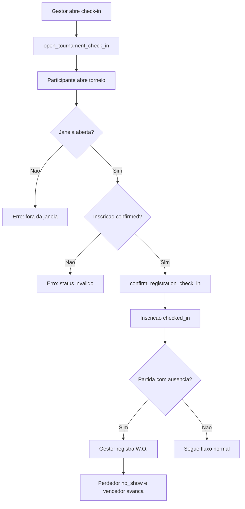

# Check-in, W.O. e desclassificacao

## Objetivo

Documentar abertura/fechamento de check-in, check-in pelo participante, check-in manual, desfazer check-in, desclassificacao e W.O.

## Atores envolvidos

- Usuario comum
- Usuario autenticado
- Capitao
- Membro de equipe
- Organizador do torneio
- Admin global
- Sistema/Supabase/RLS

## Pre-condicoes

- Inscricao existe e esta confirmada.
- Para check-in do usuario, janela de check-in esta aberta.
- Para W.O., partida da chave tem dois participantes.
- Para desclassificacao, gestor tem permissao sobre o torneio.

## Gatilho

Gestor abre `#/torneios/:id/participantes` ou `#/torneios/:id/chave`; participante abre `#/torneios/:id`.

## Caminho feliz

1. Organizador abre janela de check-in e define se ela e obrigatoria para gerar chave.
2. Participante com inscricao confirmada abre pagina publica.
3. Participante confirma check-in dentro da janela.
4. RPC `confirm_registration_check_in()` marca status `checked_in`.
5. Se `requires_check_in = true`, geracao de chave considera apenas inscritos com check-in.
6. Em ausencia numa partida, gestor registra W.O. com justificativa.
7. RPC de W.O. grava resultado `walkover`, marca perdedor com `no_show_at` e avanca vencedor.

## Fluxos alternativos

- Gestor faz check-in manual por `set_registration_check_in()`.
- Gestor desfaz check-in com justificativa.
- Gestor desclassifica inscricao com justificativa minima.
- Check-in fora da janela e bloqueado.
- Participante ja com check-in recebe retorno idempotente.
- W.O. em partida ja finalizada exige regra de correcao segura.

## Erros possiveis

- Check-in fora da janela.
- Inscricao pendente, rejeitada ou cancelada.
- Inscricao desclassificada tenta fazer check-in.
- Usuario tenta check-in de inscricao alheia.
- Justificativa curta para desfazer check-in, W.O. ou desclassificacao.
- Proxima partida ja possui resultado e impede correcao de vencedor por W.O.
- Action lock bloqueia `check_in`, `manage_registration` ou `record_result`.

## Regras de permissao

- Usuario faz check-in apenas da propria inscricao ou como capitao da equipe.
- Admin e organizador gerenciam check-in e desclassificacao.
- Admin e organizador registram W.O.
- Usuario comum nao marca outro participante como ausente.

## Regras de seguranca

- `confirm_registration_check_in()` valida dono/capitao, status e janela.
- `set_registration_check_in()` exige `can_manage_tournament()`.
- `disqualify_registration()` exige gestor e justificativa.
- `record_bracket_match_walkover()` exige gestor, participante vencedor valido e justificativa.
- Triggers usam flags internas (`app.registration_check_in`, `app.registration_disqualification`, `app.registration_no_show`) para permitir updates controlados.

## Estados envolvidos

- Inscricao: `confirmed`, `checked_in`, `cancelled`, `rejected`.
- Campos: `checked_in_at`, `checked_in_by`, `check_in_revoked_at`, `disqualified_at`, `no_show_at`.
- Resultado: `result_type = score` ou `walkover`.
- Partida: `ready`, `live`, `completed`, `disputed`.

## Dados lidos

- `tournaments`
- `tournament_registrations`
- `bracket_matches`
- `match_results`
- `action_locks`

## Dados escritos

- Campos de check-in, desclassificacao e no-show em `tournament_registrations`.
- `match_results`
- `bracket_matches`
- `match_result_history`
- `audit_logs`

## Telas envolvidas

- `#/torneios/:id`
- `#/torneios/:id/participantes`
- `#/torneios/:id/chave`

## Services envolvidos

- `src/services/tournaments.ts`
- `src/services/brackets.ts`

## Componentes envolvidos

- `PublicTournamentPage`
- `TournamentParticipantsPage`
- `TournamentBracketPage`
- `TournamentRegistrationStatusBadge`

## Fluxograma

## Casos de uso relacionados

- CHECKIN-001 Gestor abre check-in
- CHECKIN-002 Gestor fecha check-in
- CHECKIN-003 Usuario confirma check-in
- CHECKIN-004 Check-in fora da janela bloqueado
- CHECKIN-005 Gestor faz check-in manual
- CHECKIN-006 Gestor desfaz check-in
- CHECKIN-007 Check-in obrigatorio filtra chave
- CHECKIN-008 Inscricao desclassificada bloqueada
- RESULT-014 Registrar W.O.
- REG-014 Desclassificar inscricao

## Pontos de falha

- Nao ha fluxo claro de reversao de desclassificacao.
- Nao ha tela dedicada para historico de check-ins.
- W.O. altera resultado e no-show; correcao posterior precisa de cuidado quando a chave ja avancou.
- Participante de equipe que nao e capitao pode depender da regra de front-end para visualizar acao.

## Recomendacoes

- Criar historico visivel de check-in/desfazer check-in.
- Definir se membro de equipe pode fazer check-in alem do capitao.
- Criar fluxo seguro de reversao de desclassificacao ou deixar explicitamente irreversivel.
- Testar W.O. com proxima partida ja preenchida.

