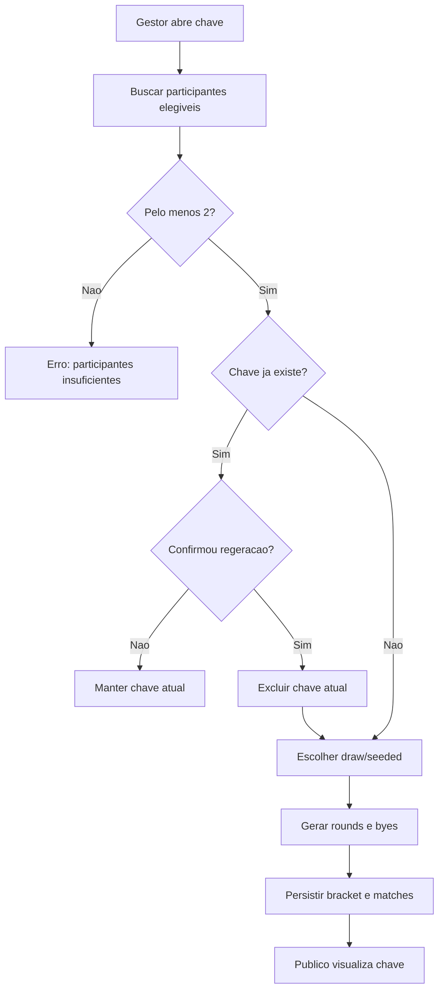

# Chave mata-mata

## Objetivo

Documentar geracao de chave `single_elimination`, sorteio, seeding, byes, regeracao, leitura publica e definicao de campeao.

## Atores envolvidos

- Visitante
- Usuario comum
- Criador autorizado
- Organizador do torneio
- Admin global
- Sistema/Supabase/RLS

## Pre-condicoes

- Torneio tem `format = single_elimination`.
- Existem pelo menos duas inscricoes elegiveis.
- Gestor tem `can_manage_tournament(tournament_id)`.
- Torneio nao esta em `draft`, `finished` ou `cancelled` para geracao.

## Gatilho

Gestor abre `#/torneios/:id/chave` e solicita geracao da chave.

## Caminho feliz

1. Gestor abre a tela de chave.
2. Service busca torneio e participantes elegiveis.
3. Gestor escolhe `draw` ou `seeded`.
4. `generateTournamentBracket()` valida formato, status e quantidade.
5. Algoritmo calcula tamanho da chave em potencia de 2.
6. Sistema cria `tournament_brackets` e `bracket_matches`.
7. Byes avancam automaticamente conforme estrutura.
8. Visitantes veem a chave de torneios publicados.
9. Quando a final e concluida, `winner_registration_id` define campeao.

## Fluxos alternativos

- Chave ja existente exige `forceRegenerate`.
- `seeded` usa `registration.seed`; inscritos sem seed completam as vagas.
- `draw` embaralha participantes no front-end antes de persistir.
- Numero impar gera byes.
- Partidas sem dois participantes ficam `pending`.
- Regeracao remove a chave atual e partidas por cascade.

## Erros possiveis

- Participantes insuficientes.
- Torneio em status invalido.
- Formato diferente de `single_elimination`.
- Participante nao elegivel por check-in obrigatorio, desclassificacao ou W.O.
- Usuario sem permissao tenta gerar.
- Chave existente sem confirmacao de regeracao.
- Action lock `generate_bracket` bloqueia.

## Regras de permissao

- Visitante le chave de torneio publicado.
- Usuario comum nao gera chave.
- Admin e organizador autorizado geram, regeram e removem chave.
- RLS em `tournament_brackets` e `bracket_matches` usa `can_manage_tournament()` para escrita.

## Regras de seguranca

- `validate_bracket_match_participants()` impede participante inelegivel na chave.
- `protect_bracket_match_update()` bloqueia alteracao manual de resultado/avanco fora de RPC.
- `assert_bracket_action_unlocked()` aplica bloqueio administrativo.
- Regeracao deve ser confirmada porque pode apagar resultados dependentes.

## Estados envolvidos

- Bracket: `generated`, `published`, `archived`.
- Match: `pending`, `ready`, `bye`, `live`, `completed`, `disputed`, `cancelled`.
- Tournament: `registrations_open`, `registrations_closed`, `ongoing`, `finished`, `cancelled`, `draft`.

## Dados lidos

- `tournaments`
- `tournament_registrations`
- `teams`
- `tournament_brackets`
- `bracket_matches`

## Dados escritos

- `tournament_brackets`
- `bracket_matches`
- `audit_logs`

## Telas envolvidas

- `#/torneios/:id/chave`
- `#/torneios/:id`
- `#/torneios/:id/participantes`
- `#/torneios`

## Services envolvidos

- `src/services/brackets.ts`
- `src/services/tournaments.ts`
- `src/lib/tournaments/singleElimination.ts`

## Componentes envolvidos

- `TournamentBracketPage`
- `TournamentParticipantsPage`
- `SupabaseTournamentStatusBadge`
- `TournamentRegistrationStatusBadge`

## Fluxograma

## Casos de uso relacionados

- BRACKET-001 Gerar chave
- BRACKET-002 Gerar com numero par
- BRACKET-003 Gerar com byes
- BRACKET-004 Gerar por sorteio
- BRACKET-005 Gerar por seeding
- BRACKET-006 Regerar chave
- BRACKET-007 Usuario comum bloqueado
- BRACKET-008 Visitante visualiza chave
- BRACKET-009 Bye avanca automaticamente
- BRACKET-010 Partida pendente por falta de participante
- BRACKET-011 Final define campeao
- BRACKET-012 Alteracao manual protegida

## Pontos de falha

- Regeracao apaga chave e partidas existentes; se houver resultados, o impacto pode ser alto.
- Nao ha status de publicacao manual da chave na UI, apesar de `status` existir.
- Seed mal preenchido afeta previsibilidade da chave.
- Algoritmo atual cobre mata-mata simples, nao melhor de N estruturado.

## Recomendacoes

- Bloquear regeracao quando houver resultados, salvo confirmacao administrativa forte com justificativa.
- Criar preview antes de persistir chave.
- Exibir criterio de sorteio/seeding na pagina publica.
- Adicionar testes para byes e avancos automaticos.

