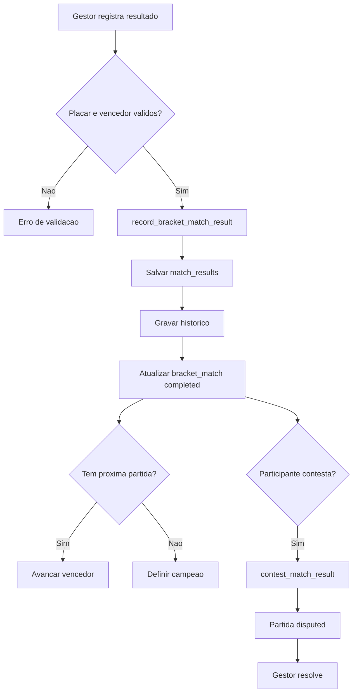

# Resultados, contestacoes e historico

## Objetivo

Documentar registro de resultado, correcao, contestacao por participante, resolucao administrativa, historico e W.O.

## Atores envolvidos

- Usuario comum
- Usuario autenticado
- Capitao
- Membro de equipe
- Organizador do torneio
- Admin global
- Sistema/Supabase/RLS

## Pre-condicoes

- Chave existe.
- Partida tem dois participantes e esta `ready` ou `live` para primeiro resultado.
- Gestor tem permissao para registrar resultado.
- Participante autenticado pertence a partida para contestar.

## Gatilho

Gestor abre `#/torneios/:id/chave` e registra placar; participante abre a mesma tela e contesta resultado finalizado.

## Caminho feliz

1. Gestor informa vencedor, placar e observacao opcional.
2. RPC `record_bracket_match_result()` valida permissao, status, vencedor e placar.
3. Sistema cria ou atualiza `match_results`.
4. Sistema grava `match_result_history`.
5. `bracket_matches` recebe placar, vencedor e `status = completed`.
6. Vencedor avanca para a proxima partida ou define campeao.
7. Resultado fica publicamente legivel em torneio publicado.

## Fluxos alternativos

- `complete_bracket_match()` chama o fluxo simples de resultado.
- Resultado finalizado pode ser corrigido com justificativa.
- Participante contesta resultado com motivo.
- Gestor resolve contestacao confirmando o resultado.
- Gestor resolve contestacao cancelando o resultado para novo lancamento.
- Gestor registra W.O. com `result_type = walkover`.

## Erros possiveis

- Placar negativo, nulo ou empatado.
- Vencedor nao pertence a partida.
- Partida e bye.
- Partida pendente sem dois participantes.
- Correcao sem justificativa.
- Correcao de vencedor com proxima partida ja finalizada/live/disputed.
- Contestacao por usuario que nao participa da partida.
- Resolucao de disputa sem observacao.
- Action lock `record_result` ou `contest_result`.

## Regras de permissao

- Admin e organizador autorizado registram, corrigem e resolvem resultados.
- Participante da partida pode contestar.
- Usuario comum nao registra resultado administrativo.
- Leitura publica de resultado existe para torneios publicados.
- Historico e restrito a gestor ou participante autenticado da partida.

## Regras de seguranca

- `protect_bracket_match_update()` obriga uso de RPC protegida.
- `record_bracket_match_result()` valida placar e avanco transacional.
- `contest_match_result()` usa `is_match_participant()`.
- `resolve_match_dispute()` impede cancelar quando a proxima partida ja tem resultado inseguro.
- `match_result_history` preserva alteracoes e justificativas.

## Estados envolvidos

- `bracket_match_status`: `ready`, `live`, `completed`, `disputed`, `bye`, `pending`, `cancelled`.
- `match_result_status`: `confirmed`, `disputed`, `resolved`, `cancelled`.
- `result_type`: `score`, `walkover`.

## Dados lidos

- `bracket_matches`
- `match_results`
- `match_result_history`
- `tournament_registrations`
- `team_members`
- `tournament_brackets`

## Dados escritos

- `match_results`
- `match_result_history`
- `bracket_matches`
- `tournament_brackets.winner_registration_id`
- `tournament_registrations.no_show_*` em W.O.
- `audit_logs`

## Telas envolvidas

- `#/torneios/:id/chave`
- `#/torneios/:id`
- `#/torneios/:id/ranking`

## Services envolvidos

- `src/services/brackets.ts`
- `src/services/rankings.ts`
- `src/lib/tournaments/matchResults.ts`

## Componentes envolvidos

- `TournamentBracketPage`
- Formularios de placar/contestacao na pagina de chave
- Badges de status da partida e resultado

## Fluxograma

## Casos de uso relacionados

- RESULT-001 Gestor registra resultado
- RESULT-002 Organizador registra resultado do proprio torneio
- RESULT-003 Usuario comum e bloqueado
- RESULT-004 Placar invalido
- RESULT-005 Empate invalido
- RESULT-006 Bye bloqueado
- RESULT-007 Resultado avanca vencedor
- RESULT-008 Final define campeao
- RESULT-009 Corrigir resultado
- RESULT-010 Contestacao por participante
- RESULT-011 Resolver contestacao confirmando
- RESULT-012 Resolver contestacao cancelando
- RESULT-013 Consultar historico
- RESULT-014 Registrar W.O.
- RESULT-015 Correcao insegura bloqueada

## Pontos de falha

- UI de contestacao pode nao considerar membro de equipe que nao e capitao, embora o banco aceite via `is_match_participant()`.
- Correcoes com chave ja avancada exigem cautela operacional.
- Historico existe, mas nao ha tela dedicada para auditoria global de cada partida alem do carregamento na chave.
- W.O. e resultado administrativo, nao substitui um fluxo completo de presenca/agenda.

## Recomendacoes

- Alinhar regra de UI com `is_match_participant()` para membros de equipe.
- Exigir justificativa tambem para toda correcao administrativa sensivel.
- Criar painel de historico por partida mais visivel.
- Testar contestacao e resolucao em partidas com proxima rodada.

