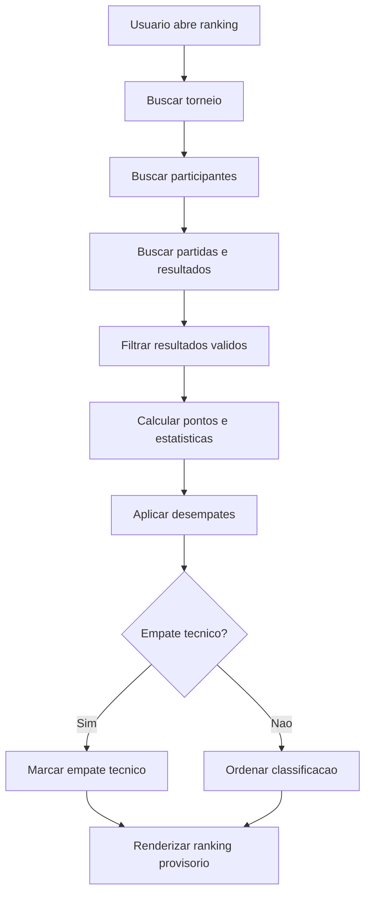

# Ranking e classificacao

## Objetivo

Documentar ranking calculado, criterios de desempate, empates tecnicos, snapshots SQL e limitacoes atuais para formatos de tabela.

## Atores envolvidos

- Visitante
- Usuario comum
- Organizador do torneio
- Admin global
- Sistema/Supabase/RLS

## Pre-condicoes

- Torneio publicado existe.
- Existem participantes elegiveis.
- Existem partidas com resultados confiaveis para contabilizar.
- `src/lib/tournaments/ranking.ts` calcula ranking no front-end.

## Gatilho

Usuario acessa `#/torneios/:id/ranking`.

## Caminho feliz

1. Pagina de ranking carrega torneio, participantes, partidas e resultados.
2. Service monta entradas elegiveis.
3. Algoritmo ignora partidas sem status finalizado ou com resultado contestado/cancelado.
4. Algoritmo aplica pontuacao padrao: vitoria, empate, derrota.
5. Algoritmo ordena por pontos, vitorias, saldo, score pro, confronto direto e fallback por seed/nome.
6. Tela exibe posicao, pontos, jogos, estatisticas e resumo do criterio.
7. Gestor pode recalcular a visao atual.

## Fluxos alternativos

- Torneio `single_elimination` mostra aviso de ranking limitado.
- Tabelas `tournament_standings` e `standing_entries` existem para snapshots, mas a UI atual nao persiste snapshot oficial.
- Formatos `round_robin`, `groups` e `groups_playoffs` estao parcialmente previstos, mas dependem de partidas persistidas.
- Empate tecnico pode ser marcado quando criterios nao resolvem completamente.

## Erros possiveis

- Torneio em `draft` sem permissao.
- Sem participantes elegiveis.
- Sem partidas contabilizaveis.
- Resultado contestado nao entra no ranking.
- Formato diz suportar ranking, mas nao ha gerador de partidas de pontos corridos/grupos.
- RLS bloqueia leitura de dados privados.

## Regras de permissao

- Visitante ve ranking de torneios publicados.
- Gestor ve ranking de torneio que gerencia, inclusive dados protegidos por RLS quando permitido.
- Escrita em snapshots SQL exige `can_manage_tournament()`.
- Usuario comum nao manipula ranking oficial.

## Regras de seguranca

- Ranking deve ser derivado de resultados confirmados ou resolvidos.
- Disputas abertas nao podem alterar classificacao oficial.
- Snapshots oficiais devem ser escritos apenas por gestor.
- Action lock `recalculate_ranking` existe para escrita em tabelas de standings.

## Estados envolvidos

- `tournament_standings.status`: `provisional`, `official`, `archived`.
- `match_result_status`: `confirmed`, `resolved`, `disputed`, `cancelled`.
- `bracket_match_status`: `completed`, `disputed`, `ready`, `pending`.
- Ranking calculado: vazio, provisorio, tecnico empatado, atualizado.

## Dados lidos

- `tournaments`
- `tournament_registrations`
- `teams`
- `bracket_matches`
- `match_results`
- `tournament_standings`
- `standing_entries`

## Dados escritos

- No fluxo atual de UI: nenhum snapshot persistido.
- Futuro/administrativo: `tournament_standings`, `standing_entries`, `audit_logs`.

## Telas envolvidas

- `#/torneios/:id/ranking`
- `#/torneios/:id`
- `#/torneios`

## Services envolvidos

- `src/services/rankings.ts`
- `src/lib/tournaments/ranking.ts`
- `src/services/tournaments.ts`

## Componentes envolvidos

- `TournamentRankingPage`
- Tabela de ranking e avisos de status da pagina
- `SupabaseTournamentStatusBadge`

## Fluxograma

## Casos de uso relacionados

- RANK-001 Visitante consulta ranking
- RANK-002 Gestor recalcula ranking
- RANK-003 Resultado pendente ignorado
- RANK-004 Resultado contestado ignorado
- RANK-005 Aplicar pontuacao
- RANK-006 Aplicar desempates
- RANK-007 Marcar empate tecnico
- RANK-008 Snapshot oficial pendente/parcial
- RANK-009 Usuario comum nao altera ranking
- RANK-010 Ranking de mata-mata limitado

## Pontos de falha

- A UI atual calcula ranking em memoria e nao grava snapshot oficial.
- `round_robin`, `groups` e `groups_playoffs` dependem de geradores de partidas que nao estao completos.
- Ranking em mata-mata pode sugerir classificacao incompleta.
- Sem teste automatizado, criterios de desempate podem regredir.

## Recomendacoes

- Implementar gerador persistido de pontos corridos/grupos antes de vender ranking como completo.
- Criar acao administrativa de publicar ranking oficial em `tournament_standings`.
- Adicionar testes unitarios para desempates.
- Mostrar claramente quando o ranking e provisorio.

