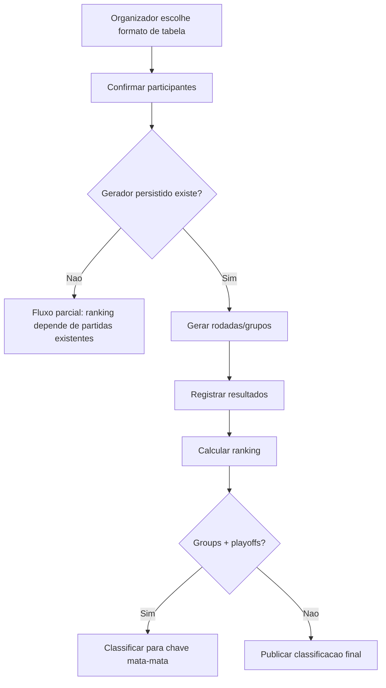

# Pontos corridos e grupos

## Objetivo

Documentar o estado atual e o fluxo esperado para pontos corridos, grupos e grupos + playoffs, separando implementado, parcial e pendente.

## Atores envolvidos

- Visitante
- Usuario comum
- Organizador do torneio
- Admin global
- Sistema/Supabase/RLS

## Pre-condicoes

- Torneio foi criado com `format = round_robin`, `groups` ou `groups_playoffs`.
- Participantes foram confirmados.
- Geracao real de tabela/grupos ainda precisa ser implementada no modelo persistido.

## Gatilho

Organizador escolhe formato de tabela no torneio ou usuario acessa ranking/rotas relacionadas.

## Caminho feliz

1. Organizador cria torneio com formato de tabela.
2. Participantes se inscrevem e sao confirmados.
3. Sistema deveria gerar rodadas, confrontos, grupos e criterios.
4. Resultados confirmados alimentariam ranking.
5. Em grupos + playoffs, classificados de cada grupo deveriam gerar uma chave mata-mata.
6. Visitante consultaria tabela, grupos, partidas e ranking.

## Fluxos alternativos

- No estado atual, ranking consegue calcular sobre partidas existentes, mas nao ha gerador persistido de pontos corridos/grupos.
- Rotas demo antigas existem para grupos/partidas, mas nao representam modulo Supabase completo.
- Tabelas `tournament_standings` e `standing_entries` podem guardar snapshots futuros.
- Grupos + playoffs pode usar a chave mata-mata existente depois de definir classificados, mas falta fluxo de classificacao para playoff.

## Erros possiveis

- Formato aparece como opcao, mas fluxo completo nao existe.
- Ranking vazio por falta de partidas persistidas.
- Usuario espera pagina de grupos real e cai em rota inexistente/demo.
- Classificacao para playoffs precisa de regra de desempate e auditoria.
- Sem tabela de grupos/rounds, nao ha fonte oficial para agenda.

## Regras de permissao

- Visitante deve ver grupos/tabela apenas de torneios publicados.
- Organizador/admin devem gerar e revisar rodadas/grupos.
- Usuario comum nao altera classificacao nem estrutura.
- Escrita futura deve usar `can_manage_tournament()`.

## Regras de seguranca

- Geracao de tabela/grupos deve ocorrer no banco ou por RPC segura para persistir auditoria.
- Alterar classificados para playoff precisa justificativa e historico.
- Recalculo de ranking deve respeitar action lock `recalculate_ranking`.
- Leitura publica nao deve expor email/RA.

## Estados envolvidos

- Formatos: `round_robin`, `groups`, `groups_playoffs`.
- Ranking: `provisional`, `official`, `archived`.
- Partidas futuras: pendente, pronta, ao vivo, finalizada, contestada, cancelada.
- Classificacao para playoffs: planejada.

## Dados lidos

- `tournaments`
- `tournament_registrations`
- `teams`
- `bracket_matches` no ranking atual
- `match_results`
- `tournament_standings`
- `standing_entries`

## Dados escritos

- Atual: nenhum fluxo completo de grupos/pontos corridos escreve estrutura propria.
- Futuro: tabelas de grupos, rodadas, partidas de fase, snapshots e auditoria.

## Telas envolvidas

- `#/torneios/:id/ranking`
- Rotas demo legadas: `#groups`, `#matches`
- Rotas planejadas antigas: `/torneios/:id/grupos`, `/torneios/:id/partidas`

## Services envolvidos

- `src/services/rankings.ts`
- `src/lib/tournaments/ranking.ts`
- Services futuros para grupos e agenda

## Componentes envolvidos

- `TournamentRankingPage`
- Componentes demo em `src/App.tsx` para grupos/partidas
- Componentes futuros de grupos, tabela e rodadas

## Fluxograma

## Casos de uso relacionados

- RR-001 Criar torneio pontos corridos
- RR-002 Gerar tabela todos contra todos
- RR-003 Registrar resultado de rodada
- RR-004 Calcular ranking
- GROUP-001 Criar grupos
- GROUP-002 Distribuir participantes
- GROUP-003 Calcular ranking por grupo
- GROUP-004 Resolver empate tecnico
- GROUP-005 Publicar classificados
- GROUP-006 Gerar playoffs
- GROUP-007 Fluxo incompleto no estado atual

## Pontos de falha

- Formatos de tabela estao no formulario, mas nao ha persistencia completa de rounds/grupos.
- Documentos antigos podem sugerir rotas ainda nao implementadas.
- Ranking reaproveita `bracket_matches`, o que nao cobre pontos corridos real.
- Falta regra oficial de classificacao para playoff.

## Recomendacoes

- Implementar tabelas/RPCs para grupos, rounds e partidas de fase antes de expor o fluxo como completo.
- Criar migracao separada para `tournament_groups`, `group_members`, `scheduled_matches` ou equivalente.
- Definir regra de classificacao para playoffs e historico de override.
- Atualizar UI para marcar formatos incompletos como beta/planejado.

