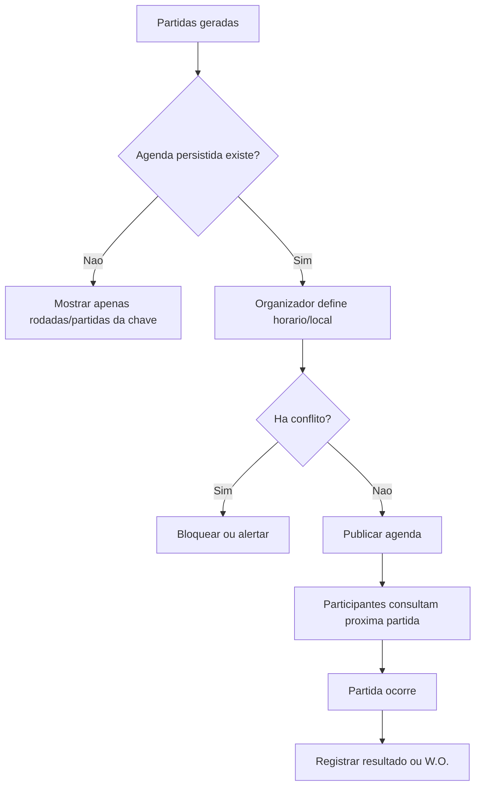

# Agendamento de partidas

## Objetivo

Documentar o fluxo esperado para agenda de partidas, conflitos de horario/local, proxima partida e estado atual pendente no MVP.

## Atores envolvidos

- Visitante
- Usuario comum
- Capitao
- Membro de equipe
- Organizador do torneio
- Admin global
- Sistema/Supabase/RLS

## Pre-condicoes

- Torneio possui chave, tabela ou grupos.
- Partidas foram geradas.
- Modelo persistido de agenda ainda nao existe no schema atual.

## Gatilho

Organizador precisa definir data, horario, local/servidor e ordem das partidas.

## Caminho feliz

1. Organizador gera partidas.
2. Sistema sugere horarios por rodada ou ordem da chave.
3. Organizador define local, horario, responsavel e observacoes.
4. Sistema valida conflitos de horario/local.
5. Participantes visualizam proximas partidas.
6. Resultado e registrado quando a partida ocorre.

## Fluxos alternativos

- Partida sem horario fica como "a definir".
- Gestor remarca partida com justificativa.
- Participante consulta proxima partida propria.
- Partida atrasada pode virar W.O. se regra do torneio permitir.
- No estado atual, nao ha agenda persistida; tela de chave mostra partidas por rodada.

## Erros possiveis

- Conflito de horario/local.
- Participante em duas partidas no mesmo horario.
- Remarcacao sem justificativa.
- Partida de chave ainda sem segundo participante.
- Rotas de agenda planejadas nao existem como modulo real.

## Regras de permissao

- Visitante ve agenda publicada.
- Participante ve propria agenda.
- Organizador/admin criam e editam agenda.
- Usuario comum nao remarca partidas.

## Regras de seguranca

- Agenda futura deve ser escrita por RPC ou service com RLS baseada em `can_manage_tournament()`.
- Remarcacoes devem gerar auditoria.
- Dados internos de contato nao devem aparecer publicamente.
- Bloqueio administrativo futuro deve impedir `schedule_match` ou acao equivalente.

## Estados envolvidos

- Planejados: `unscheduled`, `scheduled`, `delayed`, `live`, `completed`, `cancelled`, `walkover`.
- Atual: estados de `bracket_matches` sem campos formais de horario/local.

## Dados lidos

- Atual: `tournaments`, `bracket_matches`, `tournament_registrations`, `teams`.
- Futuro: tabela de agenda/partidas com horario, local, rodada e observacoes.

## Dados escritos

- Atual: nenhum dado de agenda formal.
- Futuro: partidas agendadas, remarcacoes, auditoria e notificacoes.

## Telas envolvidas

- Atual: `#/torneios/:id/chave`.
- Planejadas: `/torneios/:id/partidas`, `/partidas/:id/resultado`.
- Rotas demo antigas: `#matches`, `#result`.

## Services envolvidos

- Atual: `src/services/brackets.ts`.
- Futuro: service de agenda/partidas.

## Componentes envolvidos

- Atual: `TournamentBracketPage`.
- Futuro: calendario/lista de partidas, filtros, formulario de remarcacao e alerta de conflito.

## Fluxograma

## Casos de uso relacionados

- SCHEDULE-001 Gerar agenda automatica
- SCHEDULE-002 Agendar partida manualmente
- SCHEDULE-003 Validar conflito de local
- SCHEDULE-004 Validar conflito de participante
- SCHEDULE-005 Remarcar partida
- SCHEDULE-006 Cancelar partida
- SCHEDULE-007 Visitante consulta agenda
- SCHEDULE-008 Participante consulta proxima partida
- SCHEDULE-009 Partida atrasada vira W.O.
- SCHEDULE-010 Agenda pendente no MVP

## Pontos de falha

- Sem tabela de agenda, nao ha fonte unica para horarios.
- Rotas antigas de docs podem sugerir funcionalidade inexistente.
- W.O. existe, mas nao e acionado automaticamente por atraso.
- Notificacoes de remarcacao nao existem.

## Recomendacoes

- Criar schema de partidas agendadas antes de implementar UI real.
- Definir regra de conflito por participante, local e rodada.
- Adicionar auditoria obrigatoria para remarcacao.
- Integrar agenda com notificacoes quando modulo existir.

