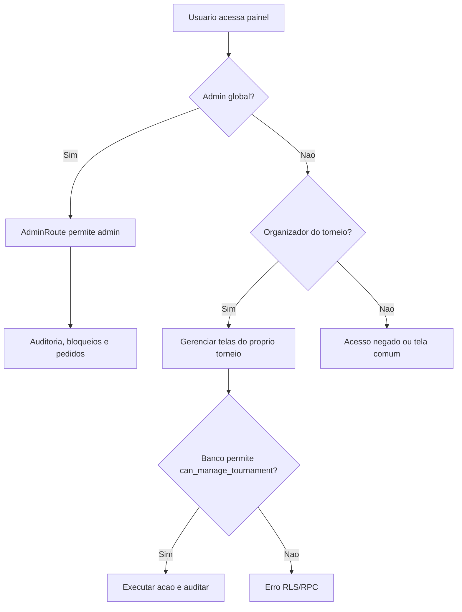

# Painel admin e organizador

## Objetivo

Documentar acesso administrativo, painel do organizador, pedidos de permissao, permissoes, auditoria, bloqueios e limites entre admin global e organizador.

## Atores envolvidos

- Usuario comum
- Criador autorizado
- Criador com permissao revogada
- Organizador do torneio
- Admin global
- Sistema/Supabase/RLS

## Pre-condicoes

- Usuario esta autenticado.
- Admin tem `profiles.role = admin`.
- Organizador tem permissao ativa e e dono do torneio.
- Services administrativos usam RLS e RPCs protegidas.

## Gatilho

Usuario acessa `#/admin`, `#/admin/pedidos`, `#/torneios/:id/participantes`, `#/torneios/:id/equipes`, `#/torneios/:id/chave` ou `#/torneios/:id/ranking`.

## Caminho feliz

1. Admin abre `#/admin`.
2. `AdminRoute` verifica role de admin no contexto.
3. Admin ve auditoria, bloqueios e dados globais permitidos.
4. Admin abre `#/admin/pedidos` e decide pedidos de criador.
5. Organizador abre telas do proprio torneio.
6. Banco valida `can_manage_tournament()` para inscricoes, equipes, chave, resultados e ranking.
7. Acoes sensiveis geram auditoria.

## Fluxos alternativos

- Usuario comum tenta `#/admin` e recebe acesso negado.
- Criador autorizado nao ve admin global, mas gerencia torneios proprios.
- Criador revogado perde capacidade de criar e, pela regra atual, pode perder gestao.
- Admin aplica action lock global ou por escopo.
- Admin consulta logs por filtros.

## Erros possiveis

- Contexto ainda carregando e UI mostra estado temporario.
- Usuario com role comum tenta acessar admin.
- Organizador tenta gerenciar torneio de outro criador.
- Criador revogado tenta editar torneio antigo.
- Action lock bloqueia acao de organizador.
- RLS bloqueia consulta por divergencia entre UI e banco.

## Regras de permissao

- Admin global acessa paineis administrativos e dados globais.
- Organizador gerencia apenas torneios proprios quando autorizado.
- Usuario comum acessa apenas suas inscricoes, perfil e pedidos.
- Admin decide pedidos e revoga permissoes.
- Apenas admin escreve `action_locks`.

## Regras de seguranca

- `AdminRoute` e camada de UX, nao substitui RLS.
- `audit_logs` tem policy de select apenas para admin.
- `action_locks` tem leitura publica limitada a bloqueios ativos e escrita admin.
- Role admin deve ser atribuida apenas por fluxo seguro.
- Nunca usar `service_role` no front-end.

## Estados envolvidos

- Profile: `admin`, `user`.
- Permissao de criador: `active`, `revoked`.
- Pedidos: `pending`, `approved`, `rejected`, `cancelled`.
- Bloqueios: ativo, inativo, expirado.
- Auditoria: logs filtrados por acao, entidade e torneio.

## Dados lidos

- `profiles`
- `tournament_creator_requests`
- `tournament_creator_permissions`
- `tournaments`
- `audit_logs`
- `action_locks`

## Dados escritos

- Decisoes de pedido.
- Permissoes revogadas/concedidas.
- Bloqueios administrativos.
- Alteracoes de torneio, inscricoes, equipes, chave, resultado e ranking conforme tela.

## Telas envolvidas

- `#/admin`
- `#/admin/pedidos`
- `#/solicitar-criacao-torneio`
- `#/meus-pedidos`
- `#/torneios/:id/participantes`
- `#/torneios/:id/equipes`
- `#/torneios/:id/chave`
- `#/torneios/:id/ranking`

## Services envolvidos

- `src/services/admin.ts`
- `src/services/tournamentCreatorRequests.ts`
- `src/services/tournaments.ts`
- `src/services/teams.ts`
- `src/services/brackets.ts`
- `src/services/rankings.ts`

## Componentes envolvidos

- `AdminRoute`
- `AdminDashboardPage`
- `AdminCreatorRequestsPage`
- `CreatorRequestCard`
- `CreatorPermissionCard`
- `SiteHeader`
- Telas de gestao do torneio

## Fluxograma

## Casos de uso relacionados

- ADMIN-001 Admin acessa painel
- ADMIN-002 Usuario comum e bloqueado
- ADMIN-003 Admin decide pedidos
- ADMIN-004 Admin revoga permissao
- ADMIN-005 Admin consulta auditoria
- ADMIN-006 Admin cria bloqueio
- ADMIN-007 Admin remove bloqueio
- ADMIN-008 Organizador gerencia inscricoes
- ADMIN-009 Organizador gerencia chave/resultados
- ADMIN-010 Criador revogado e bloqueado

## Pontos de falha

- Nao ha dashboard unico do organizador alem das telas por torneio.
- Erros de action lock podem aparecer so depois de submeter formulario.
- Revogacao de criador pode bloquear gestao de torneios ja criados; decisao precisa ficar clara.
- Admin delete de torneio tem impacto alto.

## Recomendacoes

- Criar painel "Meus torneios para gerenciar" para organizador.
- Mostrar bloqueios ativos antes da acao quando possivel.
- Exigir justificativa em acoes administrativas criticas.
- Criar revisao de seguranca para delete de torneio.

