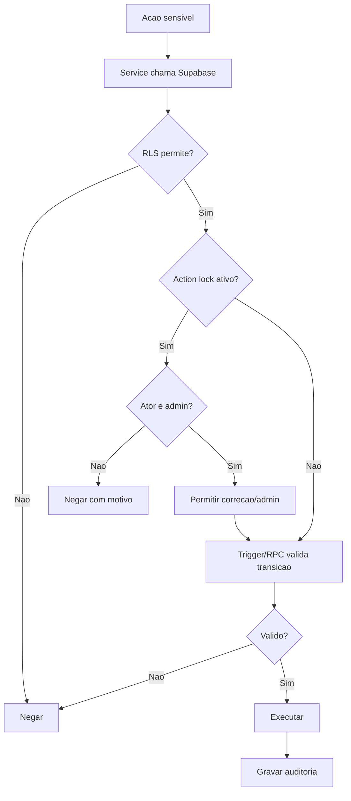

# Auditoria, bloqueios e seguranca

## Objetivo

Documentar audit logs, action locks, RLS, RPCs, triggers, validacao contra burla de front-end e pontos sensiveis de seguranca.

## Atores envolvidos

- Visitante
- Usuario comum
- Criador autorizado
- Organizador do torneio
- Admin global
- Sistema/Supabase/RLS

## Pre-condicoes

- RLS esta habilitado nas tabelas principais.
- Funcoes SECURITY DEFINER foram criadas com `search_path = public`.
- `audit_logs` e `action_locks` existem.
- Front-end usa apenas `VITE_SUPABASE_URL` e `VITE_SUPABASE_ANON_KEY`.

## Gatilho

Usuario executa acao sensivel ou admin cria bloqueio/consulta auditoria.

## Caminho feliz

1. Usuario executa acao pelo front-end.
2. Service chama Supabase com sessao atual.
3. RLS valida leitura/escrita.
4. Trigger ou RPC valida transicao de estado.
5. Action lock e consultado para a acao.
6. Se permitido, operacao conclui.
7. Trigger de auditoria grava `audit_logs` quando aplicavel.
8. Admin consulta logs em `#/admin`.

## Fluxos alternativos

- Usuario tenta chamada direta ao Supabase; RLS/triggers bloqueiam.
- Admin cria action lock global.
- Admin cria action lock por torneio, inscricao, equipe, partida ou ranking.
- Usuario comum le bloqueios ativos para entender indisponibilidade.
- Admin desativa/remove bloqueio e auditoria registra.

## Erros possiveis

- Policy incompleta permite leitura/escrita indevida.
- Funcoes SECURITY DEFINER sem search path seguro.
- Front-end mostra botao que o banco bloqueia.
- Action lock sem exibicao previa gera erro tardio.
- `ip_address` e `user_agent` ficam nulos porque SQL nao recebe esses dados do cliente.
- Tipos TypeScript ficam desatualizados frente ao schema.

## Regras de permissao

- `audit_logs` e lido apenas por admin.
- `action_locks` ativo e nao expirado pode ser lido por anon/authenticated.
- Escrita em `action_locks` e admin.
- Acoes de torneio usam `can_create_tournament()` ou `can_manage_tournament()`.
- Usuarios comuns so escrevem recursos proprios em fluxos permitidos.

## Regras de seguranca

- Nunca usar `service_role` no front-end.
- Nao armazenar senha em tabela propria.
- Validar permissoes no banco, nao apenas na interface.
- Usar RPCs para alteracoes com transicao, historico ou efeitos colaterais.
- Proteger dados pessoais (email, RA) de telas publicas.
- Auditar acoes administrativas sensiveis.

## Estados envolvidos

- Bloqueio: ativo, inativo, expirado.
- Escopos: `global`, `tournament`, `registration`, `team`, `match`, `ranking`.
- Acoes: `create_tournament`, `edit_tournament`, `delete_tournament`, `register`, `cancel_registration`, `manage_registration`, `manage_teams`, `generate_bracket`, `record_result`, `contest_result`, `recalculate_ranking`.

## Dados lidos

- `audit_logs`
- `action_locks`
- Tabelas do recurso alvo de cada acao
- Funcoes `is_admin`, `can_create_tournament`, `can_manage_tournament`, `is_action_locked`

## Dados escritos

- `audit_logs`
- `action_locks`
- Recursos de negocio quando a acao e permitida

## Telas envolvidas

- `#/admin`
- `#/admin/pedidos`
- Todas as telas com escrita sensivel

## Services envolvidos

- `src/services/admin.ts`
- `src/services/tournaments.ts`
- `src/services/teams.ts`
- `src/services/brackets.ts`
- `src/services/rankings.ts`
- `src/services/tournamentCreatorRequests.ts`

## Componentes envolvidos

- `AdminDashboardPage`
- `AdminCreatorRequestsPage`
- `ProtectedRoute`
- `AdminRoute`
- `SiteHeader`

## Fluxograma

## Casos de uso relacionados

- AUDIT-001 Log de criacao de torneio
- AUDIT-002 Log de decisao de pedido
- AUDIT-003 Log de revogacao
- AUDIT-004 Log de bloqueio
- AUDIT-005 Admin consulta logs
- AUDIT-006 Usuario comum nao consulta logs
- SECURITY-001 Burla por chamada direta bloqueada
- SECURITY-002 RLS protege dados privados
- SECURITY-003 RPC protege resultado
- SECURITY-004 Trigger protege transicao
- SECURITY-005 Action lock bloqueia acao
- SECURITY-006 Sem service_role no front-end

## Pontos de falha

- Falta captura real de IP e user-agent.
- Nem todas as acoes exigem justificativa administrativa forte.
- Sem testes automatizados de RLS, regressao de seguranca pode passar.
- Mensagens de erro do banco podem ficar pouco amigaveis.

## Recomendacoes

- Criar testes SQL/RLS por papel.
- Capturar IP/user-agent por Edge Function ou backend quando houver essa camada.
- Padronizar codigos de erro para UI.
- Exigir motivo em delete, regeracao de chave e alteracoes em torneio finalizado.

