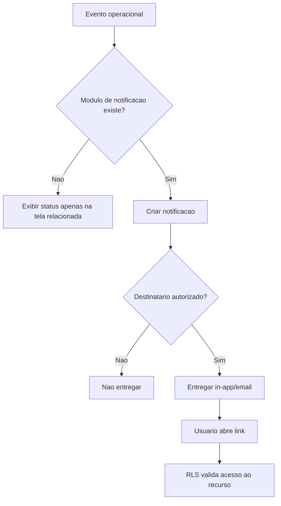

# Notificacoes e comunicacao

## Objetivo

Documentar notificacoes esperadas, comunicacao operacional e estado atual do sistema, que ainda nao possui modulo persistido de notificacoes.

## Atores envolvidos

- Visitante
- Usuario comum
- Capitao
- Membro de equipe
- Organizador do torneio
- Admin global
- Sistema/Supabase/RLS

## Pre-condicoes

- Usuarios e torneios existem.
- Eventos relevantes ocorrem: pedido decidido, inscricao confirmada, check-in aberto, partida marcada, resultado contestado.
- Nao ha tabela/service real de notificacoes no schema atual.

## Gatilho

Algum evento operacional exige avisar usuario, equipe, organizador ou admin.

## Caminho feliz

1. Evento de negocio ocorre.
2. Sistema deveria criar notificacao persistida ou enviar email/push.
3. Usuario recebe aviso com acao contextual.
4. Usuario acessa a tela correta.
5. Notificacao e marcada como lida.

## Fluxos alternativos

- Estado atual usa mensagens inline nas telas e badges de status.
- Recuperacao de senha usa email do Supabase Auth.
- Admin ve auditoria, mas auditoria nao e notificacao para usuario.
- Bloqueios ativos podem ser lidos, mas nem sempre sao exibidos preventivamente.
- Comunicacao de agenda/remarcacao e futura.

## Erros possiveis

- Usuario nao sabe que pedido foi aprovado/rejeitado sem abrir a tela.
- Participante nao e avisado de check-in aberto.
- Membro de equipe nao e avisado sobre W.O., contestacao ou remarcacao.
- Action lock bloqueia acao sem aviso previo.
- Sem tabela de notificacoes, nao ha historico de leitura.

## Regras de permissao

- Usuario ve apenas notificacoes proprias.
- Capitao pode receber notificacoes de equipe.
- Organizador recebe eventos dos torneios que gerencia.
- Admin recebe eventos globais criticos.
- Visitante nao recebe notificacao autenticada.

## Regras de seguranca

- Notificacoes nao devem expor email, RA ou dados administrativos a publico.
- Notificacao de equipe deve respeitar vinculo ativo.
- Notificacao administrativa deve respeitar role/permissao.
- Links de notificacao devem ser apenas navegacao; banco continua validando permissao.

## Estados envolvidos

- Planejados: `unread`, `read`, `archived`, `failed`.
- Canais futuros: in-app, email, push/webhook.
- Eventos: pedido, permissao, inscricao, equipe, check-in, partida, resultado, contestacao, bloqueio.

## Dados lidos

- Atual: dados de telas existentes e Supabase Auth para email de recuperacao.
- Futuro: tabela de notificacoes e preferencias de usuario.

## Dados escritos

- Atual: nenhum registro proprio de notificacao.
- Futuro: notificacoes, entregas, preferencias e auditoria de comunicacao.

## Telas envolvidas

- Atual: `#/meus-pedidos`, `#/minhas-inscricoes`, `#/torneios/:id`, `#/torneios/:id/chave`, `#/admin`.
- Futuro: central de notificacoes no header ou pagina dedicada.

## Services envolvidos

- Atual: nenhum service proprio de notificacoes.
- Futuro: `notifications.ts`, Edge Functions ou webhooks.

## Componentes envolvidos

- Atual: badges, alerts e estados vazios das paginas.
- Futuro: menu de notificacoes, lista de eventos, indicador nao lido, preferencias.

## Fluxograma

## Casos de uso relacionados

- NOTIF-001 Pedido aprovado avisa usuario
- NOTIF-002 Pedido rejeitado avisa usuario
- NOTIF-003 Inscricao confirmada/rejeitada avisa participante
- NOTIF-004 Check-in aberto avisa inscritos
- NOTIF-005 Partida agendada avisa participantes
- NOTIF-006 Resultado contestado avisa gestor
- NOTIF-007 Resolucao avisa participantes
- NOTIF-008 Bloqueio global avisa no contexto
- NOTIF-009 Notificacao in-app pendente
- NOTIF-010 Email operacional futuro

## Pontos de falha

- Ausencia de notificacoes pode fazer usuario perder prazos.
- Mensagens inline dependem de o usuario visitar a tela certa.
- Sem preferencias, nao ha controle de canal.
- Sem historico, suporte nao consegue comprovar entrega.

## Recomendacoes

- Criar modulo in-app simples antes de email/push.
- Comecar por eventos criticos: pedido, inscricao, check-in, partida e disputa.
- Exibir action locks ativos no contexto da acao antes do submit.
- Definir politica de retencao e leitura de notificacoes.

